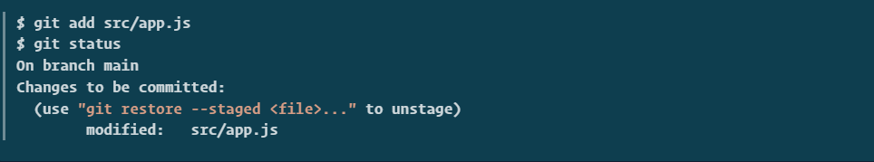
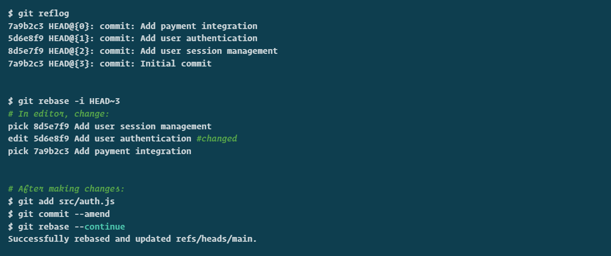

# Essential Git Commands Every Developer Should Know

As a developer, mastering Git is crucial for effective version control and collaboration. In this comprehensive guide, I'll walk you through the most essential Git commands that I use daily, complete with practical examples and best practices.


## Table of Contents
- [Git Status](#git-status)
- [Git Add](#git-add)
- [Git Commit](#git-commit)
- [Git Push](#git-push)
- [Git Pull](#git-pull)
- [Git Fetch](#git-fetch)
- [Git Rebase](#git-rebase)
- [Git Reflog](#git-reflog)
- [Git Log](#git-log)
- [Git Reset](#git-reset)

## Git Status
Shows the status of files in your working directory and staging area.

```bash
# Check the status of your repository
git status

# Get a simplified status output
git status -s
```

**Example:**
```bash
$ git status
On branch main
Changes not staged for commit:
  (use "git add <file>..." to update what will be committed)
  (use "git restore <file>..." to discard changes in working directory)
        modified:   src/app.js

Untracked files:
  (use "git add <file>..." to include in what will be committed)
        docs/
```

## Git Add
Adds files to the staging area for commit.

```bash
# Add a specific file
git add filename.txt

# Add all files
git add .

# Add all files with a specific extension
git add *.js

# Add files interactively
git add -p
```

**Example:**


## Git Commit
Records changes to the repository.

```bash
# Commit with a message
git commit -m "Your commit message"

# Add and commit in one command
git commit -am "Add and commit message"

# Amend the last commit
git commit --amend

# Commit with a detailed description
git commit -m "Add user authentication feature" -m "- Implement login/logout functionality
- Add password hashing
- Create user session management
- Add remember me option
- Update tests for new features"
```

**Example:**


## Git Push
Uploads local repository content to a remote repository.

```bash
# Push to default remote (origin) and branch
git push

# Push to specific remote and branch
git push origin main

# Force push (use with caution!)
git push -f origin main

# Push all branches
git push --all
```

**Example:**


## Git Pull
Fetches and integrates changes from a remote repository.

```bash
# Pull from default remote
git pull

# Pull from specific remote and branch
git pull origin main

# Pull with rebase instead of merge
git pull --rebase
```

**Example:**


## Git Fetch
Downloads objects and refs from a remote repository without integrating changes.

```bash
# Fetch from all remotes
git fetch --all

# Fetch from specific remote
git fetch origin

# Fetch a specific branch
git fetch origin feature-branch

# Fetch and prune deleted remote branches
git fetch -p
```

**Example:**


## Git Rebase
Reapplies commits on top of another base.

```bash
# Start an interactive rebase
git rebase -i HEAD~3

# Continue the rebase
git rebase --continue

# Abort the rebase
git rebase --abort

# Skip the current commit and continue
git rebase --skip
```

**Example:**


## Git Reflog
Shows a log of changes to the local repository's HEAD.

```bash
# Show reflog
git reflog
```
**Example:**


## Git Log
Shows commit logs.

```bash
# Show commit history
git log

# Show compact log
git log --oneline

# Show graph of commits
git log --graph --oneline --decorate

# Show commits by author
git log --author="username"

# Show commits in date range
git log --since="2 weeks ago"
```
**Example:**


## Git Reset
Resets the current HEAD to a specified state.

```bash
# Soft reset - keeps changes staged
git reset --soft HEAD~1

# Mixed reset (default) - unstages changes but keeps them in working directory
git reset HEAD~1
git reset --mixed HEAD~1

# Hard reset - discards all changes
git reset --hard HEAD~1

# Reset to specific commit
git reset --hard commit_hash

# Reset a specific file to last commit
git reset HEAD filename.txt

# Reset to remote branch state
git reset --hard origin/main

# Undo a reset using reflog
git reset --hard HEAD@{1}
```
**Example:**

